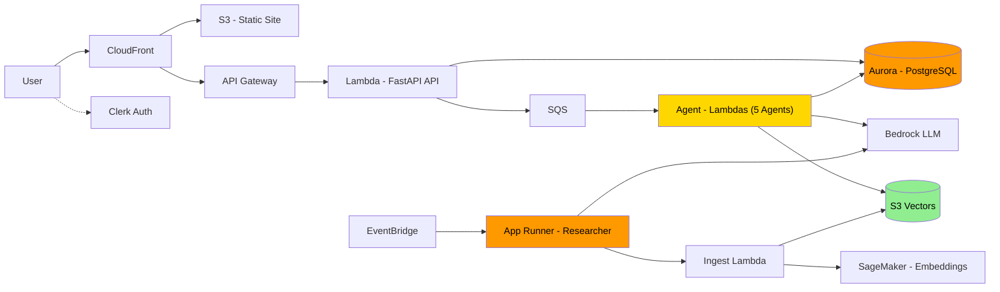
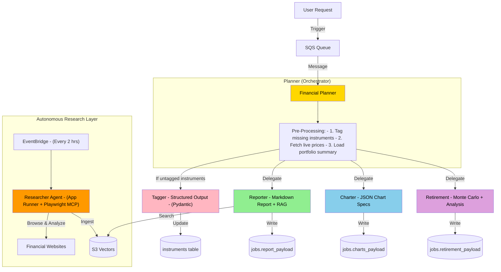
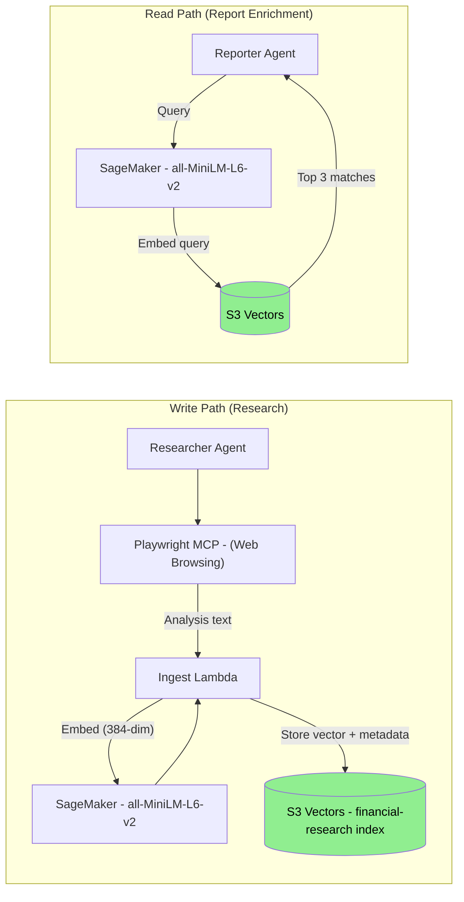
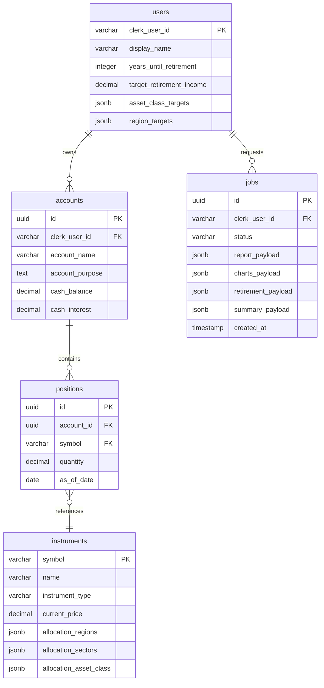

# Stratos - AI-Native Financial Advisory Platform

> **A production-grade, multi-agent SaaS platform that orchestrates 5 specialized AI agents to deliver automated portfolio analysis, interactive visualizations, and Monte Carlo retirement projections — all running on a fully serverless AWS architecture.**

---

## Table of Contents

- [Overview](#overview)
- [Key Features](#key-features)
- [System Architecture](#system-architecture)
- [Agent Orchestra](#agent-orchestra)
- [RAG Pipeline & Knowledge Base](#rag-pipeline--knowledge-base)
- [Database Schema](#database-schema)
- [Frontend](#frontend)
- [Tech Stack](#tech-stack)
- [Project Structure](#project-structure)
- [Getting Started](#getting-started)
- [Cost Analysis](#cost-analysis)
- [In Progress](#in-progress)


---

## Overview

**Stratos** is an AI-powered financial advisor for retail investors. Users manage their investment portfolios through a modern web interface, then trigger a multi-agent AI pipeline that produces:

- A **comprehensive written portfolio report** covering diversification, risk assessment, and actionable recommendations
- **Interactive chart visualizations** (asset allocation, geographic exposure, sector breakdowns) rendered via Recharts
- **Monte Carlo retirement projections** - 500 stochastic simulations calculating the probability of sustaining target income over a 30-year retirement

Behind the scenes, an autonomous **Researcher agent** continuously browses financial websites to build a knowledge base, which enriches reports through Retrieval-Augmented Generation (RAG).

---

## Key Features

**Multi-Agent Collaboration** — 5 specialized AI agents (Planner, Tagger, Reporter, Charter, Retirement) orchestrated via SQS and Lambda, each with distinct responsibilities, tools, and output formats.

**Serverless-First Architecture** — Every component auto-scales to zero when idle: Lambda for compute, Aurora Serverless v2 for the database, SageMaker Serverless for embeddings, and S3 + CloudFront for the frontend.

**Cost-Optimized Vector Storage** — S3 Vectors replaces OpenSearch for the RAG knowledge base, reducing idle costs from ~$200/month to near $0.

**Real-Time Financial Analysis** — Live stock prices via the Massive API, portfolio management with full CRUD, and AI-generated insights on demand.

**Production-Grade Practices** — Clerk JWT authentication, LangFuse + Logfire observability, Pydantic validation at every boundary, CloudWatch dashboards, dead-letter queues, and retry logic with exponential backoff.

**Full-Stack SaaS Application** — Next.js 15 React frontend with Tailwind CSS glassmorphism design, Clerk authentication, and CloudFront CDN delivery.

---

## System Architecture




---

## Agent Orchestra

The core of Stratos is a **multi-agent system** built on the **OpenAI Agents SDK** with **LiteLLM** routing to Amazon Bedrock models.




### Agent Details


| Agent          | Role                                                 | Model                | Lambda               | Tools                                                    | Output                                |
| -------------- | ---------------------------------------------------- | -------------------- | -------------------- | -------------------------------------------------------- | ------------------------------------- |
| **Planner**    | Orchestrator — coordinates all agents                | Claude via Bedrock   | `stratos-planner`    | `invoke_reporter`, `invoke_charter`, `invoke_retirement` | Job status updates                    |
| **Tagger**     | Classifies instruments (asset class, region, sector) | Claude via Bedrock   | `stratos-tagger`     | None (structured output)                                 | `InstrumentClassification` (Pydantic) |
| **Reporter**   | Writes portfolio analysis with RAG insights          | Claude via Bedrock   | `stratos-reporter`   | `get_market_insights` (S3 Vectors search)                | Markdown report                       |
| **Charter**    | Generates chart specifications for Recharts          | Claude via Bedrock   | `stratos-charter`    | None (JSON output)                                       | 4-6 chart JSON specs                  |
| **Retirement** | Monte Carlo simulation + retirement analysis         | Claude via Bedrock   | `stratos-retirement` | None                                                     | Markdown analysis with projections    |
| **Researcher** | Autonomous web researcher on a schedule              | Nova Pro via Bedrock | App Runner           | Playwright MCP, `ingest_financial_document`              | Ingested knowledge vectors            |


### Why Multi-Agent?

Instead of a single monolithic LLM prompt, Stratos uses specialized agents because smaller, focused prompts are more reliable; agents can run in parallel; each agent can be updated independently; and you only invoke the agents you need per request.

---

## RAG Pipeline & Knowledge Base

The Retrieval-Augmented Generation pipeline connects the Researcher's autonomous web browsing to the Reporter's market insights:




**Cost Comparison:**


| Service               | Monthly Cost |
| --------------------- | ------------ |
| OpenSearch Serverless | ~$200–300    |
| **S3 Vectors**        | **~$20–30**  |
| **Savings**           | **~90%**     |


---

## Database Schema

Aurora Serverless v2 (PostgreSQL 15) with the Data API — no VPC complexity, HTTP-based access from Lambda.




Each agent writes results to its own dedicated JSONB column in `jobs`, eliminating merge conflicts. Pydantic validates all data at every boundary.

---

## Frontend

A Next.js 15 static export with Tailwind CSS v4 glassmorphism design, served via CloudFront CDN.


| Route            | Page           | Description                                                                   |
| ---------------- | -------------- | ----------------------------------------------------------------------------- |
| `/`              | Landing        | Hero section, feature cards, sign-in/up CTAs                                  |
| `/dashboard`     | Dashboard      | Retirement goals, allocation targets, portfolio summary with Recharts         |
| `/accounts`      | Accounts       | Account list, create/delete, populate test data                               |
| `/accounts/[id]` | Account Detail | Positions list, add/edit/delete positions, instrument search                  |
| `/advisor-team`  | Advisor Team   | AI agent cards, trigger analysis, real-time progress visualization            |
| `/analysis`      | Analysis       | Three tabs — Overview (markdown), Charts (Recharts), Retirement (projections) |


**Design System:** Deep navy background (`#0b0d17`), sky blue primary (`#38bdf8`), purple AI accent (`#a855f7`), glassmorphism cards with `backdrop-blur-xl`, and smooth page transitions.

---

## Tech Stack

### Backend


| Technology         | Purpose                                                |
| ------------------ | ------------------------------------------------------ |
| Python 3.12 + uv   | Language & package management                          |
| FastAPI + Mangum   | REST API (local via uvicorn, production via Lambda)    |
| OpenAI Agents SDK  | Agent framework with tools, tracing, structured output |
| LiteLLM            | Model abstraction layer → routes to Amazon Bedrock     |
| Amazon Bedrock     | LLM provider (Claude Sonnet, Nova Pro)                 |
| Pydantic v2        | Validation at every boundary                           |
| Tenacity           | Retry logic with exponential backoff                   |
| Massive API        | Real-time & EOD stock price data                       |
| LangFuse + Logfire | LLM observability and tracing (In Progress)            |


### Frontend


| Technology                | Purpose                                            |
| ------------------------- | -------------------------------------------------- |
| Next.js 15 (Pages Router) | React framework with static export                 |
| TypeScript                | Type-safe development                              |
| Tailwind CSS v4           | Utility-first styling with glassmorphism theme     |
| Clerk                     | Authentication (sign-in/up, JWT, protected routes) |
| Recharts                  | Interactive charts (pie, bar, line, donut)         |
| react-markdown            | Renders AI-generated reports                       |


### Infrastructure (AWS)


| Service                   | Purpose                                        |
| ------------------------- | ---------------------------------------------- |
| Lambda                    | Compute for API + 5 agent functions            |
| App Runner                | Long-running Researcher agent (Docker)         |
| SageMaker Serverless      | Embedding endpoint (all-MiniLM-L6-v2, 384-dim) |
| Aurora Serverless v2      | PostgreSQL 15 with Data API                    |
| S3 Vectors                | Vector knowledge base for RAG                  |
| SQS + DLQ                 | Job queue for analysis orchestration           |
| API Gateway (REST + HTTP) | Ingestion API + Frontend API                   |
| CloudFront + S3           | CDN + static site hosting                      |
| EventBridge               | Scheduled research automation                  |
| Secrets Manager           | Database credentials                           |
| CloudWatch                | Dashboards, logs, metrics                      |
| Terraform >= 1.5          | Infrastructure as Code                         |


---

## Project Structure

```
stratos/
├── backend/
│   ├── api/              # FastAPI backend (Lambda)
│   ├── planner/          # Orchestrator agent
│   ├── tagger/           # Instrument classification agent
│   ├── reporter/         # Portfolio analysis agent
│   ├── charter/          # Visualization agent
│   ├── retirement/       # Retirement projection agent
│   ├── researcher/       # Autonomous web researcher (App Runner)
│   ├── ingest/           # Document ingestion Lambda
│   └── database/         # Shared database library (Pydantic + Data API)
│
├── frontend/
│   ├── pages/            # Next.js pages (dashboard, accounts, advisor-team, analysis)
│   ├── components/       # Reusable UI components
│   └── lib/              # API client, config, event system
│
├── terraform/
│   ├── 2_sagemaker/      # SageMaker embedding endpoint
│   ├── 3_ingestion/      # S3 Vectors + Ingest Lambda + API Gateway
│   ├── 4_researcher/     # App Runner + ECR + EventBridge scheduler
│   ├── 5_database/       # Aurora Serverless v2
│   ├── 6_agents/         # 5 Lambda functions + SQS + DLQ
│   ├── 7_frontend/       # CloudFront + S3 + API Gateway v2
│   └── 8_enterprise/     # CloudWatch dashboards
│
├── scripts/
│   ├── deploy.py         # Frontend deployment to S3 + CloudFront
│   ├── run_local.py      # Local dev (FastAPI + Next.js)
│   └── destroy.py        # Teardown script
│
├── .env.example          # Environment variable template
└── README.md
```
---

## In Progress

The following enterprise features are actively being built:

- **CloudWatch Dashboards** — Unified monitoring for Bedrock model invocations, token usage, latency, and error rates across all agents
- **Lambda Performance Metrics** — Dashboard tracking agent execution duration, concurrency, throttles, and cold starts
- **LLM-as-a-Judge Quality Gate** — A separate evaluation agent scores Reporter output on a 0–100 scale, replacing low-quality reports with fallback responses
- **LangFuse + Logfire Tracing** — Full observability into every agent run, tool call, and model invocation with distributed trace correlation
- **Bedrock Guardrails** — Content filtering and safety guardrails applied to all LLM-generated financial advice
- **Input/Output Validation Guardrails** — Pydantic enforcement at every agent boundary ensuring allocation percentages sum to 100%, chart JSON is Recharts-compatible, and retirement projections are within valid ranges
- **SQS Dead-Letter Queue Monitoring** — Alerting on failed analysis jobs that land in the DLQ after max retries
- **Rate Limit Resilience** — Tenacity-based exponential backoff (4–60s, up to 5 retries) on Bedrock `RateLimitError` across all agents
- **Secrets Rotation** — Aurora credentials stored in Secrets Manager with automated rotation support
- **Resource-Level Authorization Audit** — Verifying every API endpoint enforces user-scoped data access (`clerk_user_id` isolation)
- **CloudWatch Alarms** — Automated alerting on agent failures, elevated error rates, and Bedrock throttling events
- **X-Ray Distributed Tracing** — End-to-end request tracing from API Gateway through Lambda to Bedrock and Aurora

---
Built with AWS Serverless • OpenAI Agents SDK • Amazon Bedrock • Terraform
