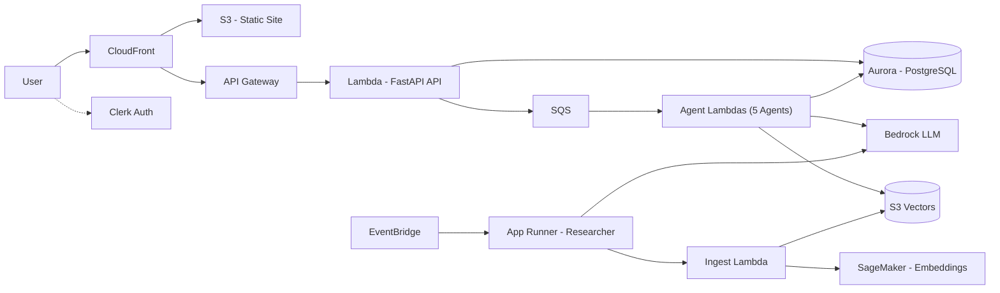
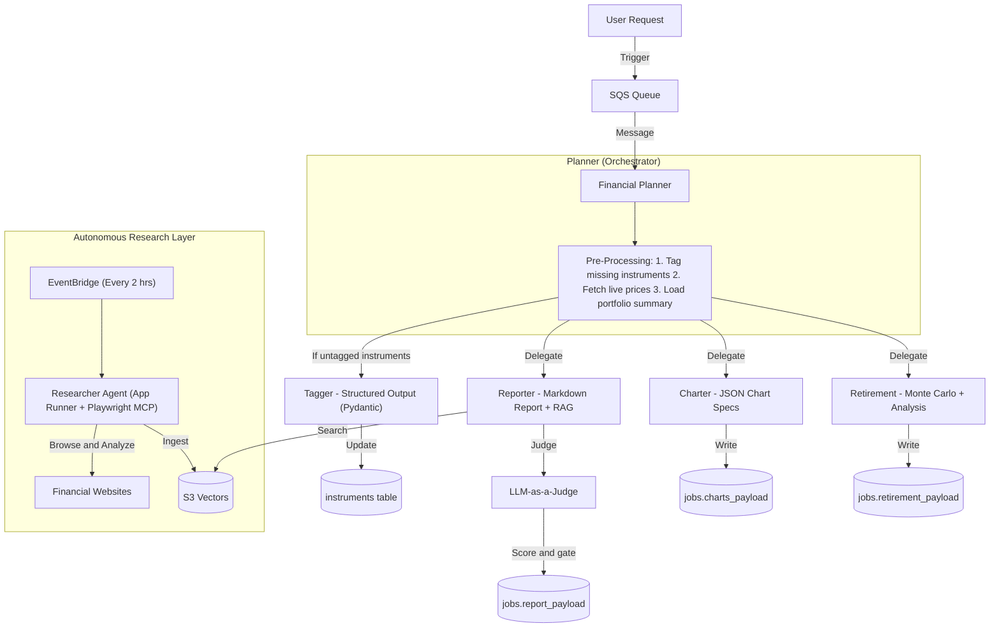
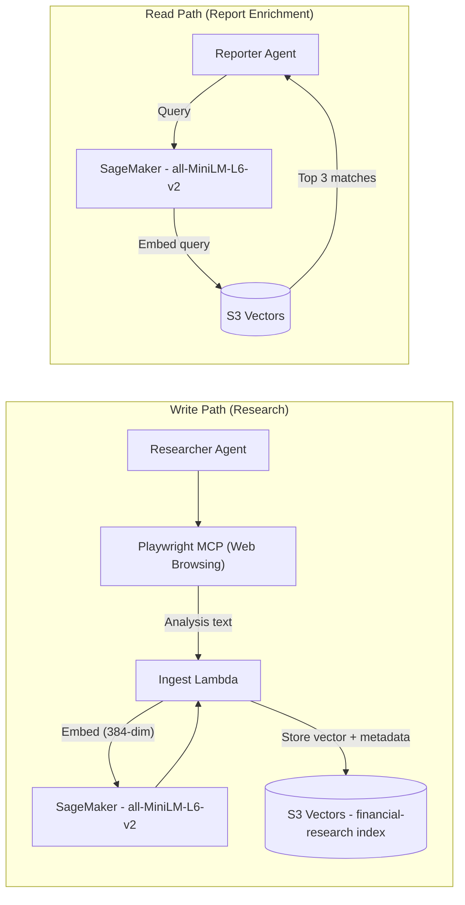
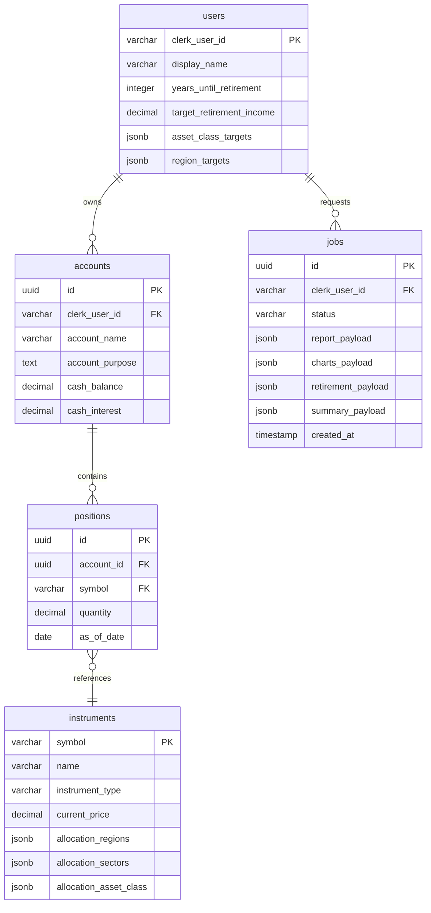

# Stratos - AI-Native Financial Advisory Platform

> **A production-grade, multi-agent SaaS platform that orchestrates 6 specialized AI agents to deliver automated portfolio analysis, interactive visualizations, and Monte Carlo retirement projections - all running on a fully serverless AWS architecture.**
> 
<p align="center">
  <a href="https://youtu.be/gLITMCZ-ksI">
    
  </a>
</p>

<p align="center">
  <b>▶️ Click the image to watch the demo</b>
</p>

## Table of Contents

- [Overview](#overview)
- [Key Features](#key-features)
- [System Architecture](#system-architecture)
- [Agent Orchestra](#agent-orchestra)
- [RAG Pipeline & Knowledge Base](#rag-pipeline--knowledge-base)
- [Database Schema](#database-schema)
- [Observability](#observability)
- [Project Structure](#project-structure)


## Overview

**Stratos** is an AI-native financial advisor for retail investors. Users manage their investment portfolios through a modern web interface, then trigger a multi-agent AI pipeline that produces:

- A **comprehensive written portfolio report** covering diversification, risk assessment, and actionable recommendations
- **Interactive chart visualizations** (asset allocation, geographic exposure, sector breakdowns) rendered via Recharts
- **Monte Carlo retirement projections** - 500 stochastic simulations calculating the probability of sustaining target income over a 30-year retirement

Behind the scenes, an autonomous **Researcher agent** continuously browses financial websites to build a knowledge base, which enriches reports through Retrieval-Augmented Generation (RAG).

---

## Key Features

**Multi-Agent Collaboration** - 6 specialized AI agents (Planner, Tagger, Reporter, Charter, Retirement, Researcher) orchestrated via SQS and Lambda, each with distinct responsibilities, tools, and output formats.

**Serverless-First Architecture** - Every component auto-scales to zero when idle: Lambda for compute, Aurora Serverless v2 for the database, SageMaker Serverless for embeddings, and S3 + CloudFront for the frontend.

**Cost-Optimized Vector Storage** - S3 Vectors replaces OpenSearch for the RAG knowledge base, reducing idle costs from ~$200/month to near $0.

**Real-Time Financial Analysis** - Live stock prices via the Massive API, portfolio management with full CRUD, and AI-generated insights on demand.

**LLM-as-a-Judge Quality Gate** -A dedicated evaluation agent scores every Reporter output on a 0–100 scale and replaces low-quality reports with a fallback response, ensuring consistent output quality.

**Production-Grade Reliability** - Clerk JWT authentication, LangFuse + Logfire observability, prompt injection guardrails, Pydantic validation at every boundary, CloudWatch dashboards, dead-letter queues, and Tenacity retry logic with exponential backoff on all Bedrock rate limit errors.

**Full-Stack SaaS Application** - Next.js 15 React frontend with Tailwind CSS v4 glassmorphism design, Clerk authentication, and CloudFront CDN delivery.

---

## System Architecture




---

## Agent Orchestra

The core of Stratos is a **multi-agent system** built on the **OpenAI Agents SDK** with **LiteLLM** routing to Amazon Bedrock models.




### Agent Details


| Agent          | Role                                                 | Model                | Compute             | Tools                                                    | Output                                |
| -------------- | ---------------------------------------------------- | -------------------- | ------------------- | -------------------------------------------------------- | ------------------------------------- |
| **Planner**    | Orchestrator — coordinates all agents                | Claude via Bedrock   | Lambda              | `invoke_reporter`, `invoke_charter`, `invoke_retirement` | Job status updates                    |
| **Tagger**     | Classifies instruments (asset class, region, sector) | Claude via Bedrock   | Lambda              | None (structured output)                                 | `InstrumentClassification` (Pydantic) |
| **Reporter**   | Writes portfolio analysis with RAG insights          | Claude via Bedrock   | Lambda              | `get_market_insights` (S3 Vectors search)                | Markdown report (Judge-gated)         |
| **Charter**    | Generates chart specifications for Recharts          | Claude via Bedrock   | Lambda              | None (JSON output)                                       | 4–6 chart JSON specs                  |
| **Retirement** | Monte Carlo simulation + retirement analysis         | Claude via Bedrock   | Lambda              | None                                                     | Markdown analysis with projections    |
| **Researcher** | Autonomous web researcher on a schedule              | Nova Pro via Bedrock | App Runner (Docker) | Playwright MCP, `ingest_financial_document`              | Ingested knowledge vectors            |


### Why Multi-Agent?

Instead of a single monolithic LLM prompt, Stratos uses specialized agents because smaller, focused prompts are more reliable; agents can run in parallel; each agent can be updated independently; and you only invoke the agents you need per request.

---

## RAG Pipeline & Knowledge Base

The Retrieval-Augmented Generation pipeline connects the Researcher's autonomous web browsing to the Reporter's market insights:




**Cost Comparison:**


| Service               | Monthly Cost |
| --------------------- | ------------ |
| OpenSearch Serverless | ~$200–300    |
| **S3 Vectors**        | **~$20–30**  |
| **Savings**           | **~90%**     |


---

## Database Schema

Aurora Serverless v2 (PostgreSQL 15) with the Data API — no VPC complexity, HTTP-based access from Lambda.




Each agent writes results to its own dedicated JSONB column in `jobs`, eliminating merge conflicts. Pydantic validates all data at every boundary.

---

## Observability

### CloudWatch Dashboards

Two CloudWatch dashboards are provisioned via Terraform and deployed to AWS:

`stratos-ai-model-usage` - Tracks Bedrock model activity across all agents:

- Invocations, client errors, and server errors per model
- Input and output token counts (stacked time series)
- Model invocation latency (p50/p99)

`stratos-agent-performance` - Tracks Lambda execution across all 5 agent functions:

- Invocation counts and error rates per function
- Duration percentiles (p50/p99) per function
- Concurrent executions

---

### LangFuse

The Reporter agent additionally logs a **Judge score** as a numeric span score in LangFuse, giving per-report quality visibility. If LangFuse credentials are not configured, the module gracefully no-ops with no impact on agent execution.

---

## Project Structure

```
stratos/
├── backend/
│   ├── api/              # FastAPI backend 
│   ├── planner/          # Orchestrator agent
│   ├── tagger/           # Instrument classification agent
│   ├── reporter/         # Portfolio analysis agent + LLM Judge
│   ├── charter/          # Visualization agent
│   ├── retirement/       # Retirement projection agent
│   ├── researcher/       # Autonomous web researcher
│   ├── ingest/           # Document ingestion Lambda (S3 Vectors)
│   ├── scheduler/        # EventBridge-triggered scheduler Lambda
│   ├── database/         # Shared database library 
│   └── guardrails.py     # Prompt injection detection + response truncation
│
├── frontend/
│   ├── pages/            # Next.js pages (dashboard, accounts, advisor-team, analysis)
│   ├── components/       # Reusable UI components
│   └── lib/              # API client, config, event system
│
├── terraform/
│   ├── 2_sagemaker/      # SageMaker embedding endpoint
│   ├── 3_ingestion/      # S3 Vectors + Ingest Lambda + API Gateway
│   ├── 4_researcher/     # App Runner + ECR + EventBridge scheduler
│   ├── 5_database/       # Aurora Serverless v2
│   ├── 6_agents/         # 5 Lambda functions + SQS + DLQ
│   ├── 7_frontend/       # CloudFront + S3 + API Gateway v2
│   └── 8_enterprise/     # CloudWatch dashboards (AI usage + agent performance)
└── README.md
```

---

Built with AWS Serverless • OpenAI Agents SDK • Amazon Bedrock • Terraform 
